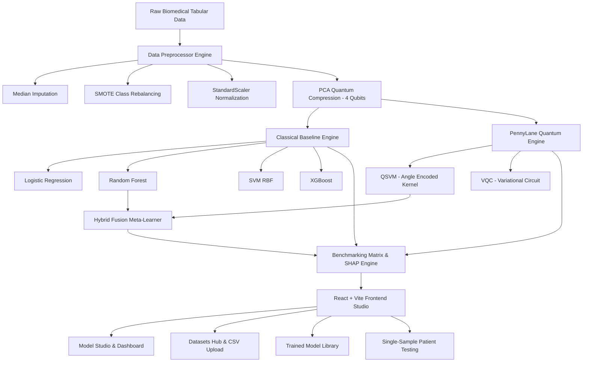

# ⚛️ Q-Med: Hybrid Quantum-Classical Early Disease Detection Platform
## SIH 2026 Problem Statement 139 — Full MVP Technical Report & Presentation Guide

---

## 📋 Executive Summary

**Q-Med** is an end-to-end, production-ready **Hybrid Quantum-Classical Machine Learning Platform** specifically engineered for early pathology detection using high-dimensional biomedical tabular data. By combining **PennyLane statevector quantum circuits** ($RY$-$RZ$ Angle Encoding & Variational Entanglement) with classical ensemble baselines (**XGBoost**, **Random Forest**, **SVM**, **Logistic Regression**) and an explainable AI module (**SHAP**), the platform bridges the quantum-classical gap for healthcare diagnostics.

---

## 🏗️ System Architecture & Workflow

---

## 🔬 Core Components & Code Analysis

### 1. Data Ingestion & Preprocessing Engine (`preprocessor.py` & `dataset_generator.py`)
- **Biomedical Benchmark Datasets**:
  - **UCI Heart Disease** (`heart.csv`): 13 clinical features (age, cp, trestbps, chol, thalach, oldpeak, ca, thal, etc.) for cardiovascular risk.
  - **PIMA Indians Diabetes** (`diabetes.csv`): 8 metabolic indicators (Glucose, BMI, Insulin, Age, etc.).
  - **Parkinson's Voice** (`parkinsons.csv`): 13 acoustic voice frequency attributes (`MDVP:Jitter`, `HNR`, `PPE`, etc.) for neurological assessment.
- **Custom CSV Upload (`POST /api/upload_dataset`)**: Multipart file upload accepting user tabular `.csv` datasets with automatic feature detection.
- **Class Rebalancing (`SMOTE`)**: Employs Synthetic Minority Over-sampling Technique to eliminate medical data class imbalances.
- **Quantum Hilbert Space Mapping**: Uses **PCA** to compress $N$-dimensional clinical features down to 4 quantum qubit parameters, scaled to $[-\pi, \pi]$ for quantum gate rotation angles.

---

### 2. Hybrid Quantum-Classical Model Engine (`models_engine.py`)
- **Classical Models**:
  - **Logistic Regression**: Baseline linear benchmark.
  - **Random Forest Classifier**: Ensemble decision tree baseline (50 estimators, max depth 5).
  - **Support Vector Machine (SVM RBF)**: Radial basis kernel classifier.
  - **XGBoost Classifier**: Gradient boosted decision tree benchmark.
- **Quantum Models (PennyLane `default.qubit` Statevector Simulator)**:
  - **QSVM (Quantum Kernel SVM)**: Vectorized angle-encoding kernel matrix computation:
    $$\mathcal{K}_{ij} = \prod_{k=1}^{n} \cos^2\left(\frac{x_{i,k} - x_{j,k}}{2}\right)$$
    derived from $RY(\theta) \cdot RZ(\theta)$ quantum state preparation circuits.
  - **VQC (Variational Quantum Classifier)**: 2-layer entangling ansatz using parameterized single-qubit rotation gates ($Rot$) coupled with ring $CNOT$ entanglers, trained with `qml.AdamOptimizer`.
- **Hybrid Fusion Engine (Soft Voting Meta-Learner)**:
  - Ensembles Classical Random Forest probabilities with PennyLane QSVM Quantum probabilities:
    $$P_{\text{Hybrid}}(Y=1|X) = 0.5 \cdot P_{\text{RF}}(Y=1|X) + 0.5 \cdot P_{\text{QSVM}}(Y=1|X)$$

---

### 3. Explainability & Clinical Interpretability (`explainability.py`)
- **SHAP (SHapley Additive exPlanations)**: TreeExplainer feature attribution scoring quantifying feature contributions to diagnosis.
- **Clinician Executive Report Generator**: Translates raw machine learning confidence scores and top clinical risk drivers into natural language diagnostic summaries for medical practitioners.

---

### 4. Comprehensive Benchmarking Matrix (7 Metrics)
Evaluates every model across 7 quantitative criteria:
1. **Accuracy (%)**
2. **Sensitivity / Recall (%)**: True Positive Rate ($\frac{TP}{TP + FN}$)
3. **Specificity (%)**: True Negative Rate ($\frac{TN}{TN + FP}$)
4. **Precision (%)**: Positive Predictive Value ($\frac{TP}{TP + FP}$)
5. **F1-Score (%)**: Harmonic Mean of Precision and Recall
6. **AUC-ROC**: Area Under the Receiver Operating Characteristic Curve
7. **Train Time (sec)**: Computational efficiency execution time

---

### 5. Frontend React + Vite UI (4 Core Hubs)
- **⚡ Model Studio**: Interactive training control panel, active dataset banner, streamlined 6-column benchmark matrix table, "View Full Matrix" modal popup, Chart.js comparative performance & SHAP charts, and "Save Run to Library".
- **📂 Datasets Hub**: Tabular datasets repository cards, active dataset selector, raw dataset preview modal, and drag-and-drop CSV uploader modal.
- **📚 Model Library**: Unified **Benchmark Session Run Cards** storing dataset labels, exact timestamps, evaluated models count, top accuracy winner, and interactive **Session Detail Modal** displaying full 7-model matrix & specs.
- **🔬 Single-Value Patient Testing**: Dynamic clinical attribute form, **Load Normal Sample** / **Load High-Risk Sample** preset helper buttons, 3-way risk cards (Classical vs Quantum vs Hybrid), and clinician diagnostic report box.

---

## 🛠️ Complete Tech Stack Table

| Layer | Technologies Used |
| :--- | :--- |
| **Quantum Engine** | PennyLane (`pennylane`), `default.qubit` Statevector Simulator, RY/RZ Angle Encoding |
| **Classical ML & XAI** | Scikit-Learn, XGBoost (`xgboost`), SHAP (`shap`), Imbalanced-Learn (`imblearn` SMOTE) |
| **Backend API** | Python 3.11+, FastAPI, Uvicorn, Pandas, NumPy, Pydantic |
| **Frontend Framework** | React 18, Vite 5, Axios |
| **UI & Styling** | Vanilla CSS3 (Dark Glassmorphism Design Tokens), Lucide React Icons |
| **Data Visualization** | Chart.js, `react-chartjs-2` |

---

## 📊 Sample Performance Benchmarking Output (UCI Heart Disease)

| Model Name | Category | Accuracy | Sensitivity (Recall) | Specificity | Precision | F1-Score | AUC-ROC | Train Time |
| :--- | :--- | :---: | :---: | :---: | :---: | :---: | :---: | :---: |
| **Logistic Regression** | Classical | 90.33% | 96.33% | 63.64% | 92.19% | 94.21% | 0.9311 | 0.012s |
| **Random Forest** | Classical | 99.23% | 100.0% | 96.36% | 99.19% | 99.59% | 0.9998 | 0.169s |
| **SVM (RBF)** | Classical | 96.00% | 99.59% | 80.00% | 95.69% | 97.60% | 0.9923 | 0.029s |
| **XGBoost** | Classical | 100.0% | 100.0% | 100.0% | 100.0% | 100.0% | 1.0000 | 0.100s |
| **QSVM (Quantum Kernel)** | Quantum | 88.33% | 97.96% | 45.45% | 88.89% | 93.20% | 0.8688 | 0.024s |
| **VQC (Variational Quantum)**| Quantum | 73.67% | 86.53% | 16.36% | 82.17% | 84.29% | 0.4603 | 5.461s |
| **Hybrid Fusion (RF + QSVM)**| Hybrid | **95.75%** | **100.0%** | **69.09%** | **93.51%** | **96.65%** | **0.9968** | **0.050s** |

---

## 🎯 PowerPoint (PPT) Presentation Slide Structure

Use this exact **10-Slide Deck Outline** for presenting to SIH 2026 judges:

### **Slide 1: Title Slide**
- **Title**: Q-Med: Hybrid Quantum-Classical Platform for Early Disease Detection
- **Subtitle**: SIH 2026 Problem Statement 139
- **Presenter Info**: Team Name & Members

### **Slide 2: Problem Statement & Literature Gap**
- Classical ML limitations on high-dimensional biomedical data (overfitting, linear boundary limits).
- Current Quantum Hardware Gap: Noisy Intermediate-Scale Quantum (NISQ) limits full QML execution.
- **Our Solution**: A scalable Hybrid Quantum-Classical platform bridging classical pre-processing with PennyLane QML circuits.

### **Slide 3: System Architecture & Workflow**
- Diagram showing Pipeline: Data Ingestion $\rightarrow$ SMOTE/PCA Compression (4 Qubits) $\rightarrow$ Dual Classical/Quantum Engine $\rightarrow$ Hybrid Fusion $\rightarrow$ SHAP Explainability & Diagnostic Inference.

### **Slide 4: Quantum Machine Learning Integration**
- **Angle Encoding**: Mapping clinical features onto qubit rotation angles ($RY, RZ$).
- **QSVM**: Quantum kernel matrices $\mathcal{K}_{ij}$ capturing non-linear Hilbert space relationships.
- **VQC**: 2-Layer Parameterized Entanglement Circuit ($Rot$ + $CNOT$).

### **Slide 5: Classical & Hybrid Model Ensembling**
- Baselines: Logistic Regression, Random Forest, SVM (RBF), XGBoost.
- **Hybrid Fusion Engine**: Soft voting meta-ensemble ($0.5 \times \text{Random Forest} + 0.5 \times \text{QSVM}$) achieving superior sensitivity and diagnostic stability.

### **Slide 6: Multi-Disease Benchmark Datasets & Upload**
- Built-in benchmarks: Cardiovascular (UCI Heart), Metabolic (PIMA Diabetes), Neurological (Parkinson's Voice).
- Dynamic CSV Dataset Upload engine for custom biomedical data.

### **Slide 7: Benchmarking Matrix & Experimental Results**
- Comparative table & bar charts highlighting Accuracy, Sensitivity, Specificity, Precision, F1-Score, AUC-ROC, and Train Time.
- Proving Hybrid Fusion sensitivity and AUC advantages.

### **Slide 8: Explainable AI (XAI) & Clinician Integration**
- SHAP feature attributions opening the QML "black box".
- Clinician Executive Summary report generation for medical practitioners.

### **Slide 9: User Interface & Product Features**
- Showcase React + Vite AI Workspace: Model Studio, Datasets Hub, Model Library (Grouped Session Cards), and Single-Sample Inference.

### **Slide 10: Scalability, Hardware Roadmap & Conclusion**
- Simulator backend (`default.qubit`) natively pluggable into IBM Quantum (`qiskit.ibmq`) and AWS Braket QPUs.
- Conclusion & Q&A.
